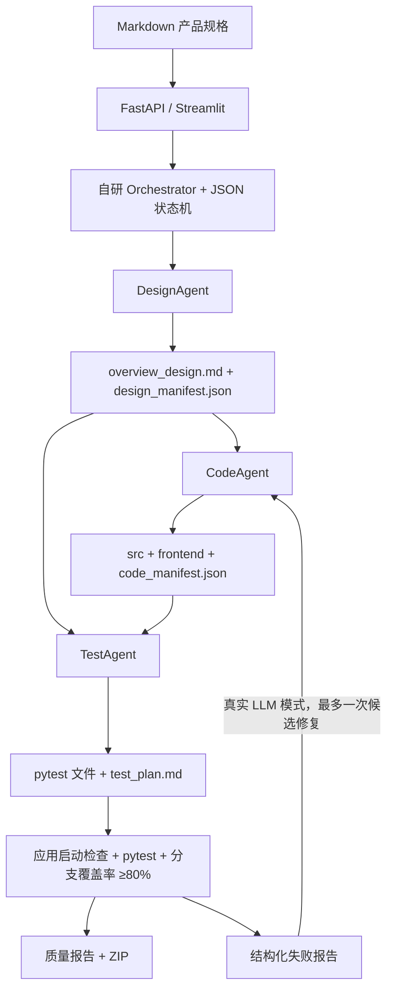

# AI Agent 全链路自动化开发系统

2026“歌尔杯”香港城市大学（东莞）第二届黑客马拉松参赛项目。

输入 Markdown 产品规格，三个独立 Agent 依次产出概要设计、FastAPI 应用、pytest 测试。编排器管理状态、依赖、重试和手动审批；质量验证器实际启动生成应用、执行测试并检查分支覆盖率，最后提供可下载应用包。

## 架构与通信



三个 Agent 是独立的执行组件，使用自己的提示词和模型配置。自研编排器、Agent 基类、Artifact 协议、状态和质量验证不依赖 LangChain、CrewAI、AutoGen 或 LangGraph。

Agent 的业务内容通过持久化 Markdown / JSON 文件交换；`ArtifactRef` 记录相对路径、种类和 SHA-256。下游重新读取文件。TestAgent 的 Prompt 包含设计文档、接口清单和源文件**路径**，不包含源代码正文或上游会话。代码通过文件系统保存，测试导入生成模块。修复反馈也是落盘 JSON，保留原测试，不用更换断言来消除失败。

`code_manifest.json` 应包含路由、请求/响应字段、错误场景、数据模型、存储表、前端页面及 `storage_contract`（服务变量、工厂导入路径、数据目录参数）。这个契约让生成测试能使用临时数据目录，避免猜测内部实现和共享业务数据。CodeValidator 会实际启动生成应用，将清单中的 HTTP 方法和路径与 FastAPI OpenAPI 对照，并检查 `src.api:app` 入口、服务变量及可导入且接受数据目录参数的工厂；不一致时失败并输出诊断。

## 运行模式与真实能力边界

| 模式 | 行为 | 使用场景 |
|---|---|---|
| 通用离线流水线 | 不调用网络模型，对所有未选择示例 fixture 的规格生成设计摘要、通用记录 CRUD 代码和测试 | 无密钥验证编排、Artifact、测试、质量门槛和打包；不实现任意领域规则 |
| 官方确定性示例 fixture | **显式选择** `vehicle_reservations`；从 `app/demo_fixtures/` 复制已编写的车辆代码和测试，不靠关键词自动触发 | 稳定演示官方场景；不作为任意规格自动生成的证据 |
| 真实 LLM | 独立调用 Design / Code / Test 模型，根据规格和持久化设计生成应用 | 尝试实现具体领域需求，结果仍需验收 |

离线模板不等于完整需求理解。通用模板会保留规格标题和需求摘要，但不自动实现任意领域规则；车辆或预约关键词也不会自动切换到官方示例。官方确定性示例 fixture 支持四园区、工作日/周末配额、配置开关、剩余车位、车牌/日期校验、重复预约、内部车辆档案拦截、CSV 模拟科拓档案、取消释放配额和幂等提前缴费。

**车辆确定性示例 fixture 的已知缺口**：没有员工登录、资源归属校验或管理员授权；休息日按周末判断，未接法定节假日历；CSV 不提供跨进程事务或跨表失败回滚。模板返回 `success=false` 和中文消息表示业务拒绝，输入模型错误使用 FastAPI 的 422。硬件道闸和真实支付均不开发。模板限制同时显示在 UI 和代码清单中。批次状态、代码清单、生成 README、UI 和 demo 输出会标明所选 fixture。97% 的测试覆盖率表示已实现代码的覆盖，不能证明全部官方业务需求已实现。

真实 LLM 的生成质量依赖模型，必须检查质量报告和验收场景。本次回归验证不需要 API Key；未以真实付费模型运行官方完整基准。

## 安装

支持 Python 3.12。先进入仓库根目录：

```bash
python -m venv .venv
# Linux / macOS
source .venv/bin/activate
# Windows PowerShell
# .venv\Scripts\Activate.ps1
python -m pip install -r requirements.txt
python -m pip check
```

复制 `.env.example` 为 `.env`（Windows 也可直接复制文件）。不填 Key 即可演示。

| 环境变量 | 说明 |
|---|---|
| `OPENAI_API_KEY` | 仅放在环境或本地 `.env`，不要提交到仓库 |
| `OPENAI_BASE_URL` | 可选 OpenAI 兼容地址；留空使用 SDK Responses API，配置后使用 Chat Completions |
| `DESIGN_MODEL` / `CODE_MODEL` / `TEST_MODEL` | 真实模式必须填写账户支持的模型名 |
| `LLM_STRICT` | 未设置时，无 Key 默认 false，有 Key 默认 true；false 允许设计/代码降级为离线模板 |
| `MAX_RETRIES` | 自动重试次数，默认 2，即最多初次执行 + 2 次重试；负数按 0 处理 |

LLM 单次请求超时 60 秒，SDK 最多额外重试一次。LLM 生成的代码无法配套生成测试时，会明确失败，不套用不相关的车辆测试或静默使用共享数据库。

## 启动平台

一条命令启动后端和控制台，Ctrl+C 关闭两者：

```bash
python -m scripts.dev
```

也可分别运行：

```bash
python -m uvicorn app.api.main:app --host 127.0.0.1 --port 8000
python -m streamlit run ui/streamlit_app.py
```

平台 API 文档：http://127.0.0.1:8000/docs
控制台：http://127.0.0.1:8501

使用一个后端进程。重复调度和同批次并发由进程内锁阻止；JSON 文件存储不支持多个 Uvicorn worker 同时执行同一批次。

## 编排、状态与恢复

批次状态：`queued → running → succeeded / failed`。`manual` 模式启动后先执行设计，随后 `paused` 等待审批代码，再暂停审批测试。测试节点失败后仍可能**自动**触发一次 CodeAgent 修复和原测试复验，无需再次手动审批；每批最多一次。依赖完成才可重试下游。

失败节点自动重试，超出次数保留失败和诊断。用户从指定节点重试时，重新给予该节点重试预算，重置该节点及下游状态、输出引用和计时；上游成功产物保持不变。日志记录所有尝试。失败或暂停批次不能通过重复 `/run` 被误标记成功。

真实 LLM 模式中，测试断言失败且没有测试执行/收集错误时，可以触发一次候选代码修复。编排器落盘失败用例名和错误摘要，请 CodeAgent 判断是否是实现缺陷并重新生成；之后复用原测试复验。覆盖率不足或收集失败不触发代码修复。每批次最多一次，前后诊断保留在 `repair_before/` 和当前测试报告中。它不是保证能自动判断任意错误的修复器。

## 质量验证

| 检查 | 实际执行 |
|---|---|
| 设计 | Markdown 非空、JSON 必需字段和 Pydantic 类型、系统名/模块/路由非空 |
| Python | 编译所有 `src/**/*.py`，检测语法及非法语句上下文 |
| 应用 | 独立子进程导入真正的 FastAPI 实例，在 TestClient 中执行 lifespan，读取 OpenAPI，并检查声明的 `/health` |
| 前端 | 根据规格和设计检查 `frontend/index.html` 及真实 form/button 标签 |
| 测试 | 在临时副本运行 pytest，读取 JUnit 计数和 pytest 退出码，单独列出收集错误 |
| 覆盖率 | 使用 pytest-cov 的 JSON 精确读取**分支覆盖率**，要求 ≥80% |

只有功能测试全部通过、存在通过的测试且覆盖率达标，Test 节点才成功。测试失败即使覆盖率达到 100% 也失败。验证使用临时应用副本，不会往生成应用或平台的业务 CSV 数据目录写入演示数据；子进程超时会保留已有输出并报告失败。

`POST /api/v1/validate` 接收 `{"batch_id":"..."}`，对已结束批次重新执行设计、应用和测试验证，分别返回诊断和总 `passed`。已知批次的质量失败作为 JSON 结果返回（HTTP 200，`passed=false`），不要只靠 HTTP 状态判断通过。缺少参数为 400，未知批次为 404，尚未结束为 409。

`BestOfSelector` 保留多设计竞选功能：按文档丰富程度、规则、路由、模块和实体数量计算启发式分数，再复制有效赢家设计到新批次生成代码和测试。这个分数不是比赛官方评分，也不是需求完整性证明。

## 平台测试

```bash
python -m pytest -q
# README 原来引用的测试文件现在真实存在：
python -m pytest tests/test_state_and_storage.py tests/test_orchestrator_and_api.py -q
```

GitHub Actions 工作流 `.github/workflows/tests.yml` 在 push / pull request 时于 Python 3.12 执行同一整套测试并保存 JUnit 报告。

测试使用临时目录和 Mock / 模拟 LLM；不需要 API Key。覆盖状态转换、原子存储、越界/符号链接路径、三 Agent 回退、自动/手动模式、重试、重复调度、API 创建/执行/Artifact/下载/验证、真实应用启动、高覆盖率下的功能失败、收集错误、低覆盖率、有界修复及官方打包基准。

## 官方端到端基准

```bash
python -m pytest tests/test_official_benchmark.py -q
python -m scripts.demo
```

`python -m scripts.demo` 默认显式选择官方确定性示例 fixture，即使环境中有 Key 也不调用模型。此结果不是任意规格自动实现的证据。使用官方 `problem/试题成果验证测试用例---产品规格说明书(员工临时车辆预约程序).md`，完成设计 → 应用 → 测试 → 质量验证 → 两笔预约场景 → ZIP。失败返回非零退出码并输出诊断路径。

最近一次官方示例基准：**13 个生成测试全部通过，分支覆盖率 97.17%**；独立检查两笔预约、配额达到上限、缴费记录园区字段、取消同步和释放配额。`samples/task_tracker.md` 的通用离线端到端基准：**3 个生成测试全部通过，分支覆盖率 97.44%**，验证规格 → 设计 → 代码 → 测试 → 质量验证 → ZIP；该基准没有专属任务实现，生成的是通用记录 CRUD。

```bash
# 无专属领域实现的通用离线任务基准
python -m pytest tests/test_generic_benchmark.py -q
python -m scripts.demo --spec samples/task_tracker.md --workspace runtime/task-demo
# 指定其他规格 / 生成目录（默认通用离线记录模板）
python -m scripts.demo --spec path/to/spec.md --workspace runtime/demo
# 明确调用真实模型
python -m scripts.demo --llm
```

`--llm` 校验 Key 和三个模型配置；默认官方规格此时不选择示例 fixture。官方两笔验收脚本仅用于确定性示例 fixture；真实模型若采用不同接口，需根据生成设计另行验收。

## 产物与运行生成应用

```text
docs/待生成/{batch_id}_{spec}.md
docs/已生成/{batch_id}/
  batch_status.json             状态、输入/输出引用、耗时、重试和质量结果
  execution_log.json            执行事件和模型/回退信息
  quality_report.json           综合质量报告
  概要设计/                     overview_design.md、design_manifest.json
  代码生成/                     code_manifest.json、src/frontend 快照
  单元测试/                     test_plan.md、测试快照、完整 pytest 输出
                                coverage.json、pytest-results.xml、test_result.json
  repair_report.json            如触发修复
output/{batch_id}/
  src/                          FastAPI 后端
  frontend/                     如需前端
  tests/generated/              生成 pytest 测试
  README.md、requirements.txt、pytest.ini、code_manifest.json、quality_report.json
  benchmark_result.json         官方 demo 命令的两笔验收结果
output/{batch_id}.zip            demo 命令生成；API 也可实时打包下载
```

ZIP 排除业务数据、缓存、字节码和符号链接；携带安装依赖、测试配置和质量报告。下载后解压，进入应用根目录：

```bash
python -m pip install -r requirements.txt
python -m uvicorn src.api:app --port 8001
python -m pytest tests/generated -q --cov=src --cov-branch --cov-report=term-missing
```

离线模板前端由生成后端同源提供，浏览器访问 http://127.0.0.1:8001 。使用 8001 避免与平台 8000 冲突。真实 LLM 生成应用以其 README 和清单为准。

## 主要 API

| 方法 | 路径 | 用途 |
|---|---|---|
| GET | `/health` | 平台健康 |
| GET / POST | `/api/v1/batches` | 批次列表 / 上传创建 |
| GET | `/api/v1/batches/{id}` | 完整状态 |
| POST | `/api/v1/batches/{id}/run` | 启动 queued 批次 |
| POST | `/api/v1/batches/{id}/advance` | manual 审批下一节点 |
| POST | `/api/v1/batches/{id}/retry/{node}` | 重试并重置下游 |
| GET | `/api/v1/batches/{id}/logs` | 执行日志 |
| GET | `/api/v1/batches/{id}/artifacts` | 持久化 Artifact 列表 |
| GET | `/api/v1/batches/{id}/download?path=...` | 下载该批次 Artifact |
| GET | `/api/v1/batches/{id}/package` | 下载应用 ZIP |
| POST | `/api/v1/validate` | 独立端到端复验 |
| GET | `/api/v1/batches/{id}/score` | 启发式设计评分 |
| POST | `/api/v1/batches/best-of` | 比较 `batch_ids`，创建并执行赢家衍生批次 |

## 3–5 分钟演示

1. **0:00–0:40**：打开控制台，展示产品规格及三个独立 Agent / Artifact 通信，说明本次用离线模式保证可重复。
2. **0:40–1:40**：显式选择官方确定性示例 fixture、manual 模式启动。展示设计 Markdown / JSON，审批 Code 和 Test，查看节点耗时、重试和产物。
3. **1:40–2:30**：显示测试通过数和覆盖率，点击端到端复验，展示设计/启动/pytest 的独立结果；下载应用包。
4. **2:30–4:00**：启动生成应用于 8001，提交两笔不同车牌预约；展示 CSV 档案、提前缴费、取消以及剩余配额变化。
5. **4:00–5:00**：展示测试失败诊断/一次修复回归测试，以及其他领域的通用回归，说明真实 LLM 模式与模板功能缺口。

赛题文件保持原样。提交前补齐员工认证/管理员授权或使用真实模型生成后验收，并录制不超过 10 分钟的视频。

## 项目目录与依赖

```text
app/adapters/       LLM 协议、OpenAI / Mock 适配器
app/agents/         Design / Code / Test 独立 Agent、通用离线 CRUD 模板
app/demo_fixtures/ 官方车辆预约确定性示例代码和测试
app/orchestrator/   状态、调度、日志、重试、有界修复、BestOf
app/storage/        文件存储、Artifact 哈希、安全打包
app/validators/     设计、启动、测试和覆盖率验证
app/api/            FastAPI 平台接口
ui/                 Streamlit 控制台
prompts/            每个 Agent 的系统提示词
scripts/            demo、官方两笔验收、平台启动命令
tests/              平台回归、官方示例与通用任务端到端测试
samples/            非车辆任务规格
problem/            官方赛题和规格（不修改）
docs/audit.md       初始问题和按影响排序的实施记录
```

开源依赖：FastAPI / Uvicorn 提供 API 与 ASGI 服务；Streamlit 提供控制台；Pydantic 提供契约验证；OpenAI SDK 提供模型调用；python-dotenv 加载本地环境；pytest / pytest-cov / coverage 提供测试与覆盖率；httpx 支持 TestClient；requests 支持 UI 调用；python-multipart 支持上传。

团队分工待补充：需求与设计负责人、Agent/编排负责人、测试与验证负责人、UI/演示与文档负责人。请用真实姓名和实际贡献替换，不预填未知人员信息。
